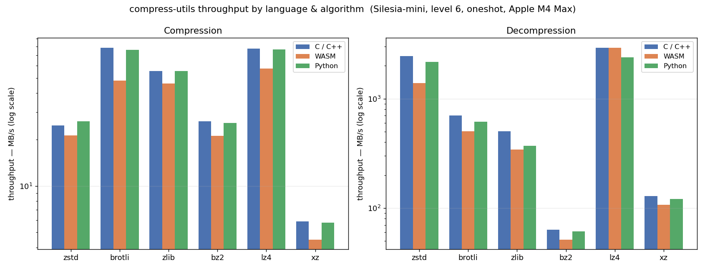

# compress-utils benchmarks

A language-agnostic harness for measuring compression **ratio**, **compress /
decompress throughput**, and (for WASM) **module size** across every binding
and algorithm. Three jobs:

1. **Regression** — guard size/speed when we change build flags (e.g. the WASM
   size work in [`docs/wasm-size.md`](../docs/wasm-size.md)) or bump a codec.
2. **Per-language** — compare the same algorithm across C / Python / JS / Rust …
   on one corpus with one metric definition.
3. **Vs. ecosystem** — compare against each language's native alternatives
   (`node:zlib`, Python `zstandard`, the Rust `zstd` crate, …) on the same
   inputs. _(Baseline drivers land alongside the language drivers.)_

Status: **C, C-native baseline, WASM (Node), and Python drivers implemented** —
all one-shot + streaming. Corpora: `smoke` (synthetic), `silesia`,
`silesia-mini`, `enwik8`. Ecosystem-library baselines (JS/Python native libs)
are not done yet — see TODO.md.

## Language comparison



The same six codecs across the three language bindings, measured back-to-back in
one interleaved run (Silesia-mini, level 6, one-shot). Compression **ratio is
identical** across languages — only throughput differs:

- **Python ≈ native C.** The binding is the C core via pybind11, so compress is
  ~1.0× and decompress ~1.0–1.4× (overhead only shows on the fastest decoders).
- **WASM ~1.2–1.3× slower to compress, ~1.1–1.8× to decompress.** zstd decode is
  the worst case (native SIMD tricks); lz4 decode is nearly free (memory-bound).

Regenerate with `python3 benchmarks/plot_langs.py` after a 3-way run.

## Quick start

```sh
./build.sh --release                 # produces dist/c/ + algorithms/dist/ (drivers link them)
python3 benchmarks/runner.py         # runs the matrix, writes results/<…>.json
python3 benchmarks/report.py         # prints a table + writes results/plots/*.png
```

Overlay the binding against its native-library baseline (measures wrapper
overhead — the two should land on top of each other):

```sh
python3 benchmarks/runner.py --drivers c,c-baseline
python3 benchmarks/report.py         # plots show solid=compress-utils, dashed=baseline
```

Narrow the matrix while iterating:

```sh
python3 benchmarks/runner.py --algos zstd,brotli --levels 1,9 --samples 9 --warmup 2
```

Pick a corpus tier (default `smoke`):

```sh
python3 benchmarks/runner.py --corpus silesia          # standard real-world corpus
python3 benchmarks/runner.py --corpus smoke,enwik8     # merge tiers
```

Benchmark streaming as well as one-shot (default `oneshot`):

```sh
python3 benchmarks/runner.py --modes oneshot,stream --chunk 65536
```

Regression diff between two runs (same machine):

```sh
python3 benchmarks/report.py new.json --baseline results/baseline-c.json
```

## Layout

```
benchmarks/
  corpus/
    corpora.py       tier registry + resolve() — the runner's entry point
    generate.py      synthetic 'smoke' tier (fixed seed → reproducible)
    fetch.py         fetched tiers: silesia, enwik8 (download + extract + verify)
    manifest.json    synthetic per-file sha256 (tracked)
    fetched.lock.json  sha256 lock for fetched corpora, trust-on-first-use (tracked)
    data/            generated/extracted inputs (gitignored)
    cache/           downloaded archives (gitignored)
  drivers/
    c/bench_harness.h  shared C harness: timing, stats, NDJSON, job loop
    c/bench.c          compress-utils driver (wraps the cu_* ABI)
    c/bench_baseline.c  baseline: raw libzstd/libbrotli/… linked directly
    wasm/bench_wasm.mjs   compress-utils WASM package via Node (records module size)
    python/bench_py.py    compress-utils Python binding
  lib/
    bench_common.py  run metadata, result schema, throughput math
  runner.py          builds a driver, runs the matrix, writes results
  report.py          tables, plots, regression diff
  plot_langs.py      cross-language comparison chart for this README
  assets/            tracked chart(s) embedded above
  results/           output JSON + plots (gitignored; commit baselines explicitly)
```

## Corpora (tiers)

Selected with `--corpus` (comma-separated; `all` = every tier):

| Tier      | Contents                                            | Source | Size |
|-----------|-----------------------------------------------------|--------|------|
| `smoke`   | 4 synthetic datasets (text/json/binary/random)      | generated, fixed seed | ~6 MB |
| `silesia` | the standard 12-file real-world corpus              | fetched (per-file zips) | ~211 MB |
| `enwik8`  | 100 MB Wikipedia text — the standard ratio benchmark | fetched | 100 MB |

`smoke` is the default and the **only tier suited to CI**: deterministic, no
network, fast. The fetched tiers are for on-demand local runs (slower, larger).

**Integrity.** Synthetic data is reproducible from `generate.py` and checked
against `manifest.json`. Fetched corpora are pinned **trust-on-first-use**: the
first download records each file's sha256 into `fetched.lock.json` (tracked),
and every later run verifies against it — a changed upstream download fails
loudly. Downloads cache under `corpus/cache/`; payloads extract to
`corpus/data/` (both gitignored). Delete `data/<id>` to force a re-fetch.

## Metric definitions

- **ratio** = uncompressed ÷ compressed bytes (higher = smaller output).
- **throughput** = uncompressed bytes ÷ median time, in MB/s (MB = 1e6),
  reported for **both** directions normalized to uncompressed size (lzbench
  convention).
- Timing wraps only the one-shot `compress` / `decompress` call. Buffer
  allocation and I/O are excluded. We report **median + MAD + min** over the
  sampled iterations after a warmup.
- Every job **round-trips and byte-compares** once; an unverified record is a
  correctness failure, not a benchmark result.

### Why three gating strategies

| metric        | determinism      | gating                                              |
|---------------|------------------|-----------------------------------------------------|
| module size   | exact            | hard CI gate, committed baselines                   |
| ratio         | ~exact per codec | cross-language invariant + strict regression (>1%)  |
| throughput    | noisy            | trend + large-move threshold (>8%), dedicated HW    |

Throughput must only be compared between runs on the **same machine** — the
runner stamps a CPU fingerprint into every result file and `report.py` warns
when a regression diff crosses machines.

**Impls are measured interleaved.** The runner runs every driver on each job
spec back-to-back (persistent processes, one job line → one result line), not
all-of-A-then-all-of-B. This keeps two impls in the same thermal/throttle
window — running them minutes or hours apart silently corrupts the comparison
(a fast codec's true overhead is ~0, so any time-skew shows up as fake
overhead). On macOS the runner also holds off sleep via `caffeinate`, and it
checkpoints the results file every 64 specs so a long run is never
all-or-nothing.

## Driver protocol

Every language driver is a process that:

- reads **one job per line** from stdin: `<algo> <level> [<mode>] <path>` where
  `mode` is `oneshot` (default if omitted) or `stream`; `path` may contain spaces
- writes **one NDJSON object per job** to stdout, in input order
- honors env `BENCH_SAMPLES` (default 5), `BENCH_WARMUP` (default 1),
  `BENCH_CHUNK` (stream chunk size, default 65536)
- prints `{"lang","version","driver"}` and exits when invoked with `--info`
- for a `stream` job on an algorithm it doesn't stream, emits nothing (skip)

Each result object carries raw measurements; the runner enriches with derived
`ratio` / `*_mbps` and attaches run metadata:

```json
{
  "lang": "c", "impl": "compress-utils", "algo": "zstd", "level": 6,
  "mode": "oneshot", "chunk_bytes": 0,
  "input": "/abs/path/text.bin", "input_bytes": 1500000, "output_bytes": 412345,
  "compress_ns_median": 1234567, "compress_ns_mad": 1234, "compress_ns_min": 1200000,
  "decompress_ns_median": 234567, "decompress_ns_mad": 234, "decompress_ns_min": 230000,
  "samples": 5, "warmup": 1, "verified": true
}
```

**Modes.** One-shot times `cu_compress`/`cu_decompress`; streaming feeds the
input in `chunk`-sized pieces through the `cu_*_stream_*` drain protocol and
times the whole operation. Streaming and one-shot can produce slightly
different output for the same level (different framing), so they're tracked as
distinct series. Both the compress-utils driver and the native baseline
implement streaming (the baseline mirrors each library's native streaming API
— `ZSTD_compressStream2`, `deflate`, `BrotliEncoderCompressStream`, etc.), so
stream mode gets a full cu-vs-native overlay.

## Adding a language driver

1. Implement the protocol above (read jobs, time `samples`+`warmup`, emit
   NDJSON, support `--info`).
2. Register a builder/locator in `runner.py`'s driver dispatch.
3. The corpus, matrix, schema, tables, plots, and regression logic are reused
   as-is.

## Comparing against ecosystem baselines (goal 3)

A "baseline" is the language's native alternative for an algorithm — Python
`zstandard`, `node:zlib`, the Rust `zstd` crate, raw `libzstd` in C. These are
**in-process library calls in a sibling driver**, _not_ CLI subprocesses:

- **CLI is for interop/correctness**, which `tests/interop/cli_crosscheck.py`
  already covers — not for throughput. Shelling out measures `fork`+`exec` +
  file I/O on top of the codec; process spawn (~1–5 ms) dwarfs compressing a
  1.5 MB buffer for fast codecs, so the numbers would reflect the OS, not the
  library, and wouldn't be apples-to-apples across CLIs (differing block
  sizes, threading, buffering).
- A baseline driver runs the **same corpus, the same warmup/sample/median
  methodology, the same in-memory buffer-to-buffer timing, on the same
  machine** — the only variable is the library.

Each record carries an `impl` field distinguishing our binding from the
baseline for the same `(lang, algo)`; it defaults to `"compress-utils"` and a
baseline driver sets e.g. `"zstandard"` or `"node:zlib"`. `report.py` overlays
implementations on the Pareto plot (color = algorithm, line style = impl) and
keys regressions on it. For C specifically, the baseline is raw upstream
`libzstd`/`libbrotli`/… — it measures the binding's **wrapper overhead** and
sets the throughput ceiling.
